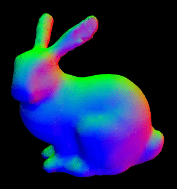

# taubin-smooth
A pure JavaScript implementation of Taubin's mesh smoothing algorithm.



## [DEMO](https://mikolalysenko.github.io/taubin-smooth/index.html)

# Install

```
npm i taubin-smooth
```

# API

#### `require('taubin-smooth')(cells, positions[, options])`
Takes a mesh as input, returns the smoothed vertices as output

* `cells` are the cells of the mesh
* `positions` are the coordinates of the vertices
* `options` is an optional object containing any of the following configuration parameters:
    + `iters` the number of smoothing iters to run (default `10`)
    + `passBand` a scalar between `0` and `1` determining the cutoff frequency. (default `0.1`)

# Credits

Development supported by [Standard Cyborg](http://www.standardcyborg.com/)


(c) 2017 Mikola Lysenko. MIT License
